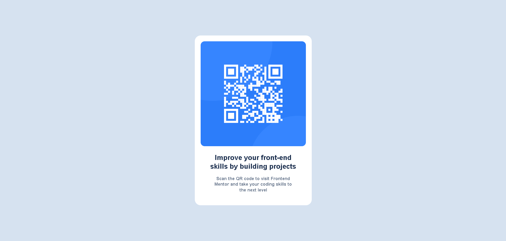

# Frontend Mentor - QR code component solution

This is a solution to the [QR code component challenge on Frontend Mentor](https://www.frontendmentor.io/challenges/qr-code-component-iux_sIO_H). Frontend Mentor challenges help you improve your coding skills by building realistic projects.

## Table of contents

- [Overview](#overview)
  - [Screenshot](#screenshot)
  - [Links](#links)
- [My process](#my-process)
  - [Built with](#built-with)
  - [What I learned](#what-i-learned)
  - [Continued development](#continued-development)
  - [AI Collaboration](#ai-collaboration)
- [Author](#author)

## Overview

### Screenshot



### Links

- Solution URL: [GitHub Repository](https://github.com/dawudasasfeh/QR-code-component)
- Live Site URL: [QR code component](https://qr-code-component-sable-one.vercel.app/)

## My process

### Built with

- Semantic HTML5 markup.
- CSS custom properties.
- Flexbox.

### What I learned

Learned how to center text in the center of the card and justify the alignment

```css
.title {
  color: hsl(218, 44%, 22%);
  padding: 0 auto;
  margin: 0 auto;
  max-width: 80%;
  font-size: 26px;
  font-weight: 700;
  line-height: 1.25;
  margin-bottom: 20px;
}
```

### Continued development

My next step is learning React and continuing to build small projects to gain more hands-on experience, just like I did with this challenge.

### AI Collaboration

I used GitHub Copilot to help me plan my implementation and follow better practices while building. At the end, I compared my result against the target design and used Copilot to review what still needed improvement.

## Author

- Website - [Dawud Alasasfeh](#)
- Frontend Mentor - [@dawudasasfeh](https://www.frontendmentor.io/profile/dawudasasfeh)
